# DCX Cloud Platform - Complete Business Specification

## Executive Summary & Platform Overview

The DCX Cloud Platform is a comprehensive multi-tenant cloud management system that enables resellers to provision, manage, and bill cloud services to their customers. The platform operates on a three-tier model: Datacentrix (root provider), Resellers (channel partners), and Customers (end users).

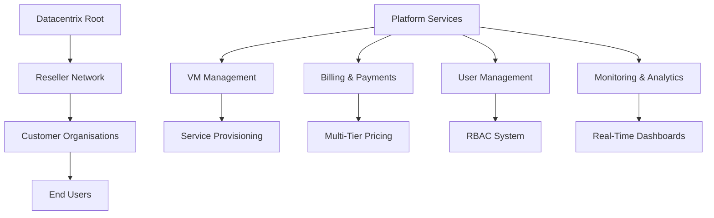
```mermaid
graph TD
    A[Datacentrix Root] --> B[Reseller Network]
    B --> C[Customer Organisations]
    C --> D[End Users]
    
    E[Platform Services] --> F[VM Management]
    E --> G[Billing & Payments]
    E --> H[User Management]
    E --> I[Monitoring & Analytics]
    
    F --> J[Service Provisioning]
    G --> K[Multi-Tier Pricing]
    H --> L[RBAC System]
    I --> M[Real-Time Dashboards]
```

### Business Model & Commercial Framework

The platform operates on a wholesale-to-retail commercial model where:
- **Datacentrix** provides wholesale infrastructure and platform services
- **Resellers** purchase services at wholesale rates and sell to customers at retail rates
- **Customers** consume cloud services and pay retail rates
- **Commission Structure**: 7.5-12.5% margin for resellers based on volume commitments

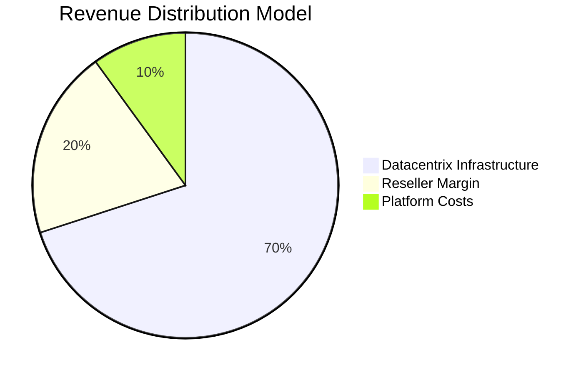
```mermaid
pie title Revenue Distribution Model
    "Datacentrix Infrastructure" : 70
    "Reseller Margin" : 20
    "Platform Costs" : 10
```

---

## Module 1: Authentication & Access Management - Business Rules

### Purpose & Scope
The authentication system ensures secure access to the platform whilst maintaining strict data isolation between competing resellers and their customers.

### Business Rules & Policies

#### User Access Hierarchy
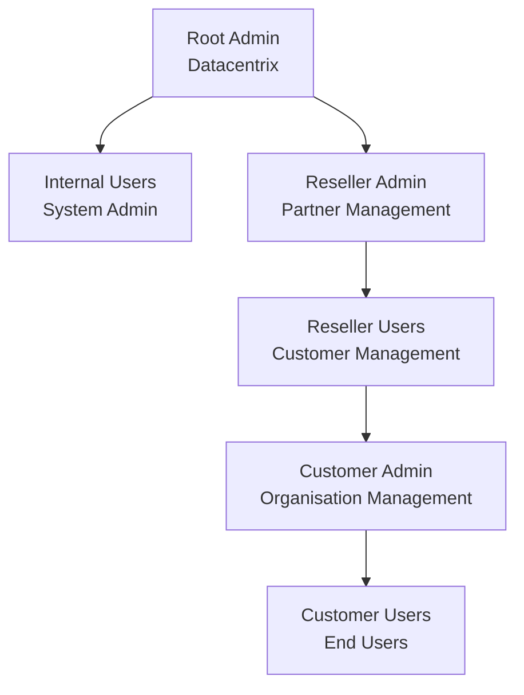
```mermaid
graph TB
    A[Root Admin<br/>Datacentrix] --> B[Internal Users<br/>System Admin]
    A --> C[Reseller Admin<br/>Partner Management]
    C --> D[Reseller Users<br/>Customer Management]
    D --> E[Customer Admin<br/>Organisation Management]
    E --> F[Customer Users<br/>End Users]
```

#### Access Control Policies
1. **Data Isolation**: Resellers cannot access each other's customer data
2. **Hierarchical Access**: Users can only manage subordinate levels
3. **Scope-Based Permissions**: Access limited to organisational boundaries
4. **Time-Based Sessions**: Automatic logout after inactivity periods
5. **Multi-Factor Authentication**: Required for administrative roles

#### Authentication Workflows
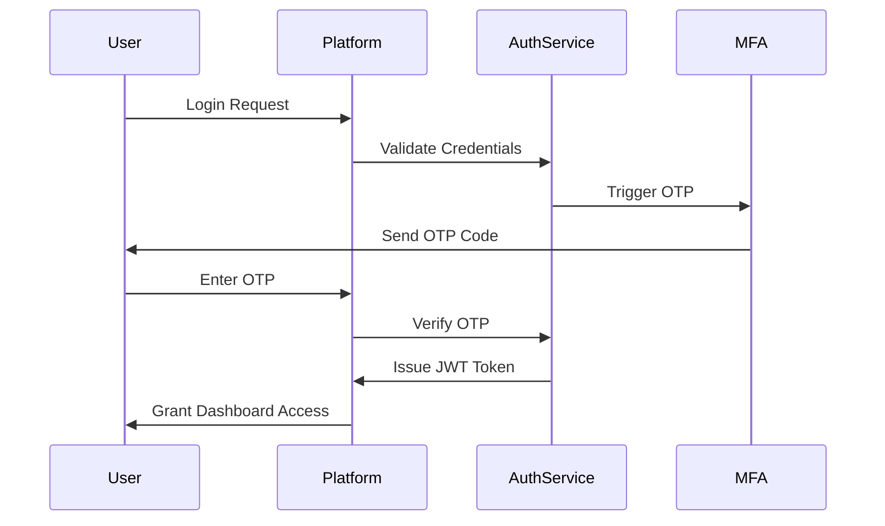
```mermaid
sequenceDiagram
    participant User
    participant Platform
    participant AuthService
    participant MFA
    
    User->>Platform: Login Request
    Platform->>AuthService: Validate Credentials
    AuthService->>MFA: Trigger OTP
    MFA->>User: Send OTP Code
    User->>Platform: Enter OTP
    Platform->>AuthService: Verify OTP
    AuthService->>Platform: Issue JWT Token
    Platform->>User: Grant Dashboard Access
```

### Role Definitions & Responsibilities

| Role Type | Access Scope | Business Responsibilities |
|-----------|--------------|---------------------------|
| Root Admin | Global System | Platform configuration, reseller onboarding |
| Internal User | Cross-Reseller | Customer support, technical operations |
| Reseller Admin | Reseller Estate | Customer onboarding, billing management |
| Reseller User | Assigned Customers | Daily customer management |
| Customer Admin | Organisation | Team management, service configuration |
| Customer User | Limited Functions | Service consumption, basic monitoring |

### Security & Compliance Requirements
- **Data Protection**: GDPR-compliant data handling
- **Audit Trails**: Complete access logging for compliance
- **Session Management**: Secure token handling and refresh
- **Password Policies**: Minimum complexity requirements
- **Failed Attempt Handling**: Progressive lockout mechanisms

---

## Module 2: User & Organisation Management - Operational Procedures

### Purpose & Scope
User and organisation management enables the platform's multi-tenant architecture, allowing resellers to manage their customer organisations whilst maintaining complete data isolation.

### Organisational Structure
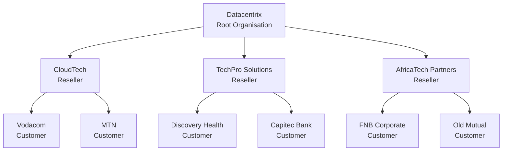
```mermaid
graph TD
    A[Datacentrix<br/>Root Organisation] --> B[CloudTech<br/>Reseller]
    A --> C[TechPro Solutions<br/>Reseller]
    A --> D[AfricaTech Partners<br/>Reseller]
    
    B --> E[Vodacom<br/>Customer]
    B --> F[MTN<br/>Customer]
    C --> G[Discovery Health<br/>Customer]
    C --> H[Capitec Bank<br/>Customer]
    D --> I[FNB Corporate<br/>Customer]
    D --> J[Old Mutual<br/>Customer]
```

### User Lifecycle Management

#### Customer Onboarding Process
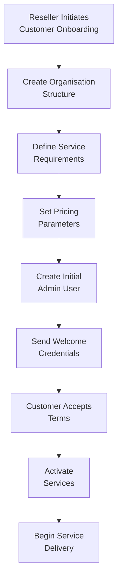
```mermaid
flowchart TD
    A[Reseller Initiates<br/>Customer Onboarding] --> B[Create Organisation<br/>Structure]
    B --> C[Define Service<br/>Requirements]
    C --> D[Set Pricing<br/>Parameters]
    D --> E[Create Initial<br/>Admin User]
    E --> F[Send Welcome<br/>Credentials]
    F --> G[Customer Accepts<br/>Terms]
    G --> H[Activate<br/>Services]
    H --> I[Begin Service<br/>Delivery]
```

#### User Invitation & Provisioning
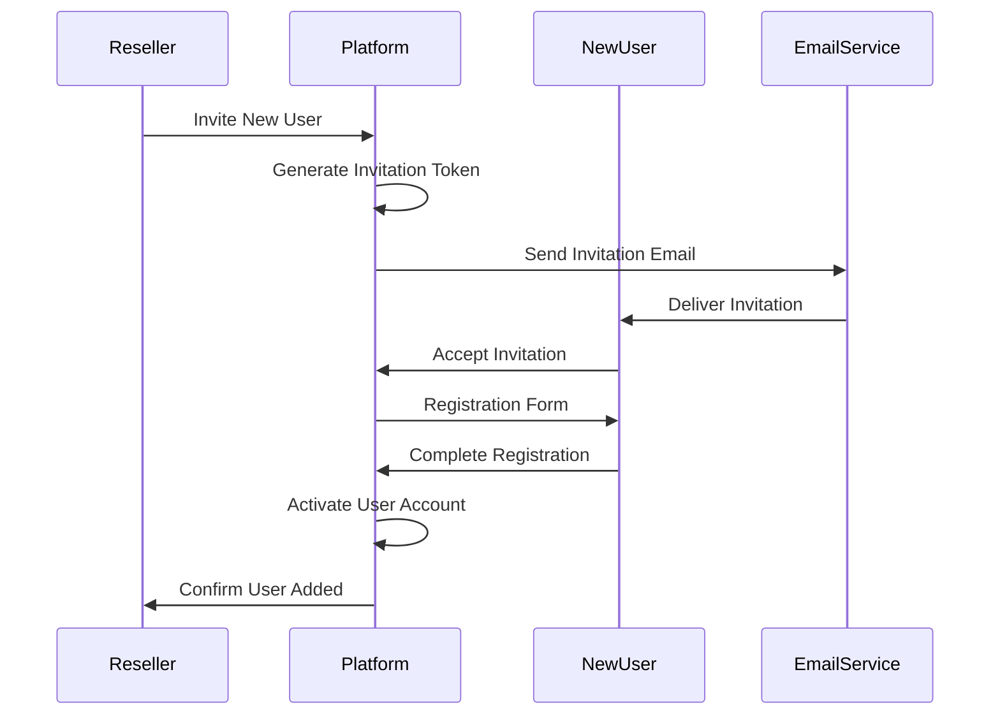
```mermaid
sequenceDiagram
    participant Reseller
    participant Platform
    participant NewUser
    participant EmailService
    
    Reseller->>Platform: Invite New User
    Platform->>Platform: Generate Invitation Token
    Platform->>EmailService: Send Invitation Email
    EmailService->>NewUser: Deliver Invitation
    NewUser->>Platform: Accept Invitation
    Platform->>NewUser: Registration Form
    NewUser->>Platform: Complete Registration
    Platform->>Platform: Activate User Account
    Platform->>Reseller: Confirm User Added
```

### Team & Hierarchy Management
- **Department Structure**: Align users with organisational departments
- **Delegation Policies**: Define who can manage whom
- **Approval Workflows**: Multi-level approvals for significant changes
- **Temporary Access**: Guest access and temporary permissions

### Data Ownership & Responsibilities
- **Customer Data**: Owned by customer organisation
- **Billing Data**: Shared between reseller and customer
- **Platform Data**: Owned by Datacentrix
- **Backup & Recovery**: Defined per service level agreement

---

## Module 3: Core Platform Services - Service Definitions

### Purpose & Scope
The core platform delivers infrastructure-as-a-service capabilities including virtual machine management, backup services, and cloud infrastructure.

### Service Portfolio
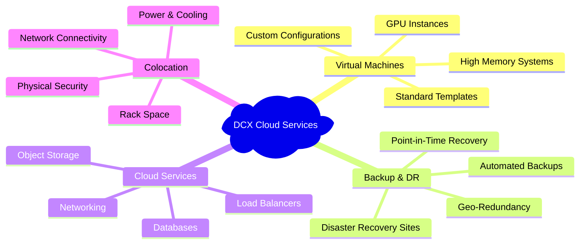
```mermaid
mindmap
  root)DCX Cloud Services(
    Virtual Machines
      Standard Templates
      Custom Configurations
      GPU Instances
      High Memory Systems
    Backup & DR
      Automated Backups
      Point-in-Time Recovery
      Disaster Recovery Sites
      Geo-Redundancy
    Cloud Services
      Object Storage
      Load Balancers
      Databases
      Networking
    Colocation
      Rack Space
      Power & Cooling
      Network Connectivity
      Physical Security
```

### Service Level Agreements

#### Performance Standards
- **VM Availability**: 99.9% uptime guarantee
- **Network Performance**: Sub-10ms latency within region
- **Backup Recovery**: 4-hour recovery time objective
- **Support Response**: 1-hour for critical issues

#### Service Delivery Process
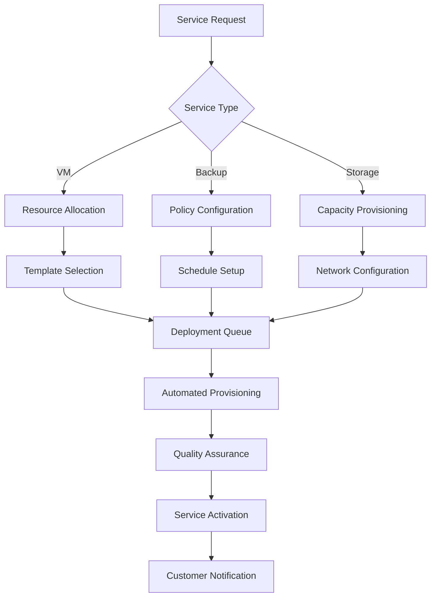
```mermaid
flowchart TD
    A[Service Request] --> B{Service Type}
    B -->|VM| C[Resource Allocation]
    B -->|Backup| D[Policy Configuration]
    B -->|Storage| E[Capacity Provisioning]
    
    C --> F[Template Selection]
    D --> G[Schedule Setup]
    E --> H[Network Configuration]
    
    F --> I[Deployment Queue]
    G --> I
    H --> I
    
    I --> J[Automated Provisioning]
    J --> K[Quality Assurance]
    K --> L[Service Activation]
    L --> M[Customer Notification]
```

### Virtual Machine Management

#### VM Lifecycle Management
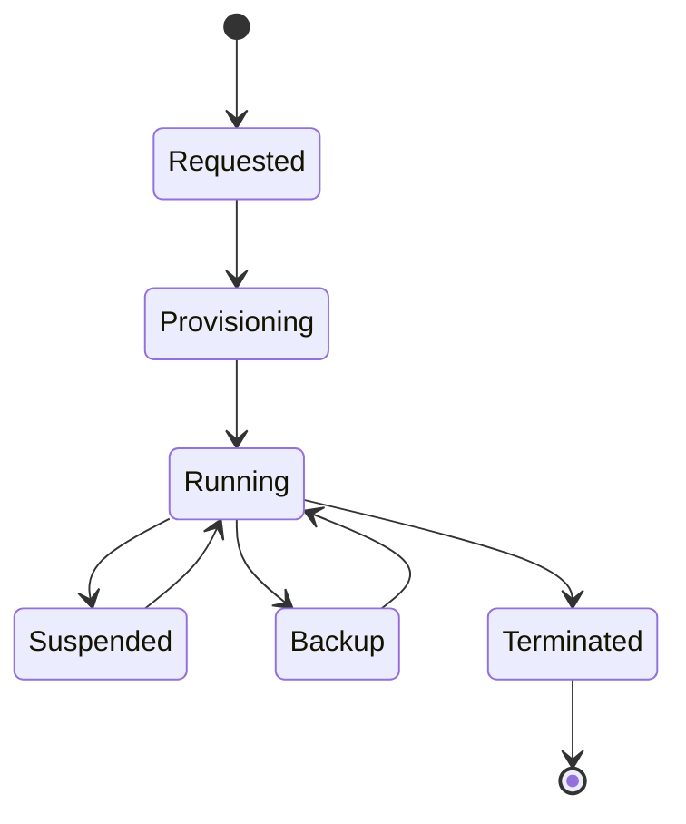
```mermaid
stateDiagram-v2
    [*] --> Requested
    Requested --> Provisioning
    Provisioning --> Running
    Running --> Suspended
    Suspended --> Running
    Running --> Backup
    Backup --> Running
    Running --> Terminated
    Terminated --> [*]
```

#### Template & Configuration Options
- **Standard Templates**: Pre-configured operating systems
- **Custom Builds**: Bespoke configurations for specific requirements
- **Resource Scaling**: Vertical and horizontal scaling options
- **Performance Tiers**: Different performance levels for varying needs

### Backup & Disaster Recovery Services
- **Automated Scheduling**: Configurable backup frequencies
- **Retention Policies**: Customisable retention periods
- **Geographic Distribution**: Multiple data centre locations
- **Recovery Testing**: Regular disaster recovery drills

---

## Module 4: Financial & Commercial System - Commercial Logic

### Purpose & Scope
The financial system manages multi-tier pricing, billing cycles, payment processing, and commission structures across the reseller network.

### Pricing Model Architecture
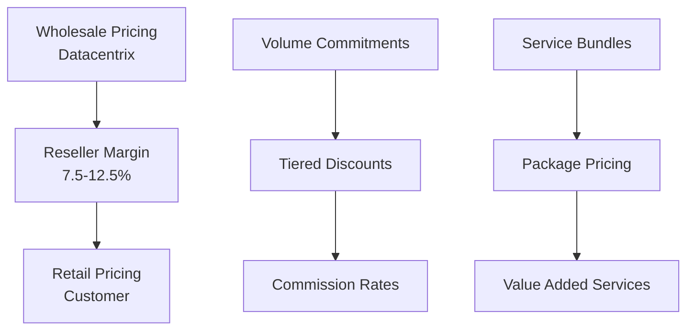
```mermaid
graph TD
    A[Wholesale Pricing<br/>Datacentrix] --> B[Reseller Margin<br/>7.5-12.5%]
    B --> C[Retail Pricing<br/>Customer]
    
    D[Volume Commitments] --> E[Tiered Discounts]
    E --> F[Commission Rates]
    
    G[Service Bundles] --> H[Package Pricing]
    H --> I[Value Added Services]
```

### Commercial Structure

#### Revenue Model Overview
The platform operates on a three-tier commercial model:

| Tier | Entity | Commercial Role | Pricing Authority |
|------|--------|----------------|-------------------|
| Tier 1 | Datacentrix | Infrastructure Provider | Wholesale Pricing |
| Tier 2 | Resellers | Channel Partners | Retail Pricing |
| Tier 3 | Customers | End Consumers | Service Consumption |

#### Pricing Calculation Flow
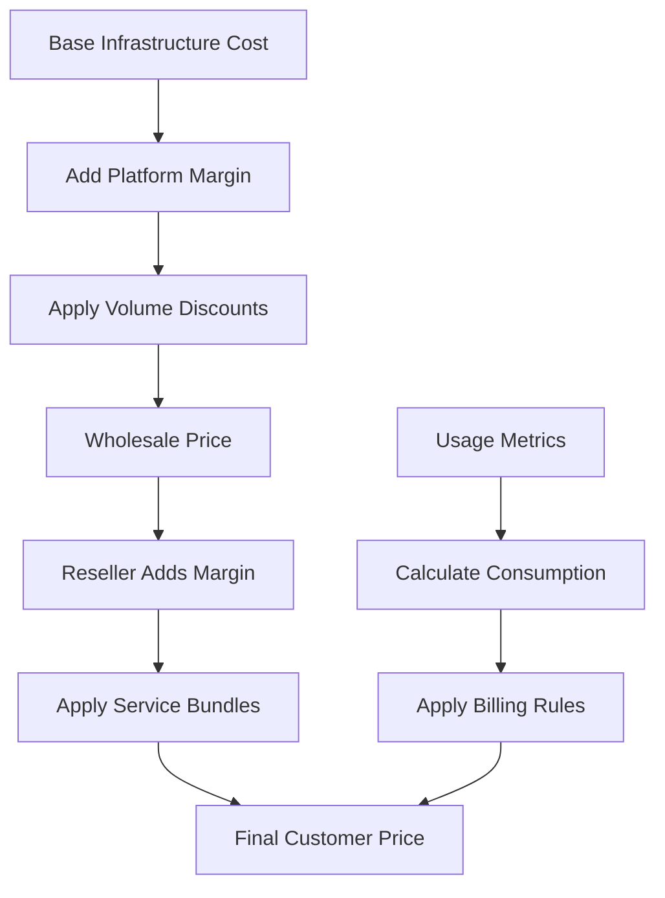
```mermaid
flowchart TD
    A[Base Infrastructure Cost] --> B[Add Platform Margin]
    B --> C[Apply Volume Discounts]
    C --> D[Wholesale Price]
    D --> E[Reseller Adds Margin]
    E --> F[Apply Service Bundles]
    F --> G[Final Customer Price]
    
    H[Usage Metrics] --> I[Calculate Consumption]
    I --> J[Apply Billing Rules]
    J --> G
```

### Billing & Payment Workflows

#### Monthly Billing Cycle
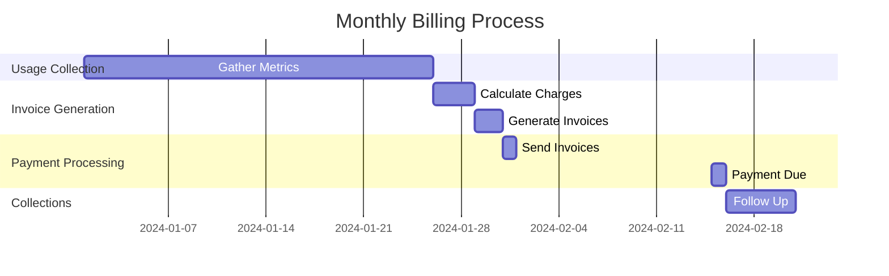
```mermaid
gantt
    title Monthly Billing Process
    dateFormat  YYYY-MM-DD
    section Usage Collection
    Gather Metrics    :2024-01-01, 25d
    section Invoice Generation
    Calculate Charges :2024-01-26, 3d
    Generate Invoices :2024-01-29, 2d
    section Payment Processing
    Send Invoices     :2024-01-31, 1d
    Payment Due       :2024-02-15, 1d
    section Collections
    Follow Up         :2024-02-16, 5d
```

#### Payment Processing Journey
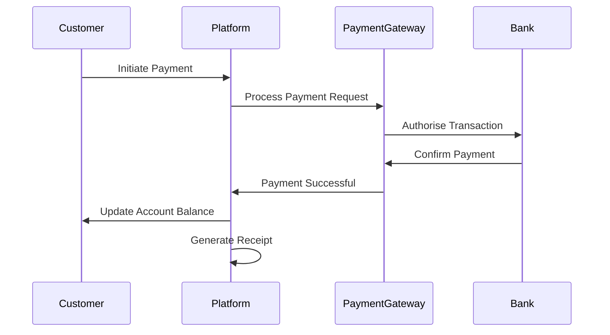
```mermaid
sequenceDiagram
    participant Customer
    participant Platform
    participant PaymentGateway
    participant Bank
    
    Customer->>Platform: Initiate Payment
    Platform->>PaymentGateway: Process Payment Request
    PaymentGateway->>Bank: Authorise Transaction
    Bank->>PaymentGateway: Confirm Payment
    PaymentGateway->>Platform: Payment Successful
    Platform->>Customer: Update Account Balance
    Platform->>Platform: Generate Receipt
```

### Wallet & Credit Management

#### Credit System Logic
- **Pre-paid Credits**: Customers purchase credits in advance
- **Post-paid Billing**: Monthly invoicing for consumed services
- **Credit Limits**: Configurable spending limits per organisation
- **Auto-recharge**: Automatic credit top-ups when balance low

#### Commission & Revenue Sharing
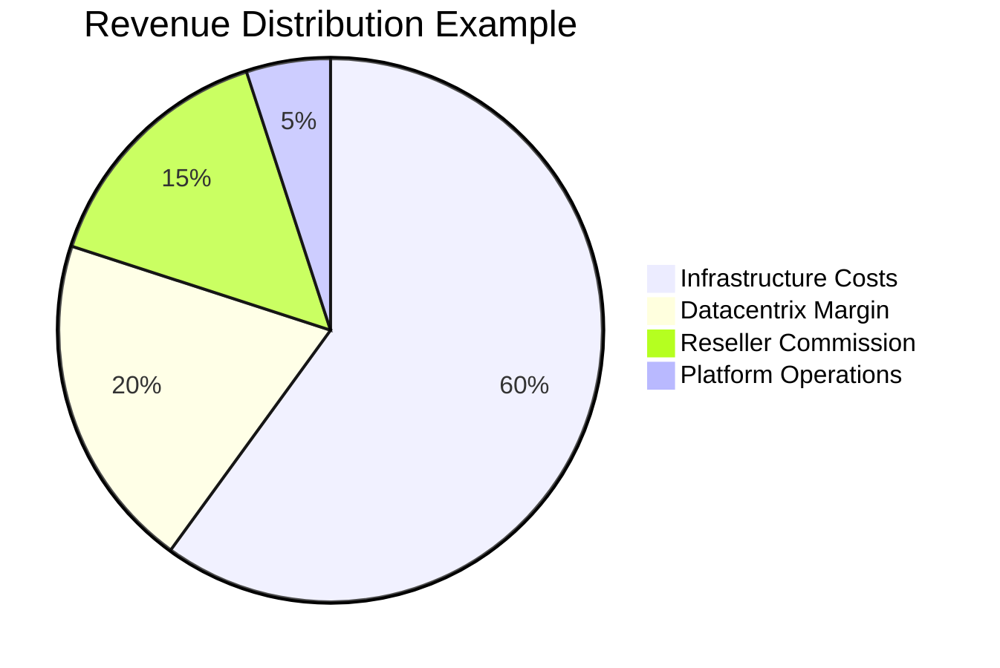
```mermaid
pie title Revenue Distribution Example
    "Infrastructure Costs" : 60
    "Datacentrix Margin" : 20
    "Reseller Commission" : 15
    "Platform Operations" : 5
```

### Contract & Subscription Management
- **Service Contracts**: Formal agreements defining service levels
- **Billing Terms**: Payment schedules and credit terms
- **Renewal Processes**: Automatic and manual renewal options
- **Termination Procedures**: Service discontinuation workflows

---

## Module 5: Multi-Tenant Architecture - Business Structure

### Purpose & Scope
The multi-tenant architecture enables complete business isolation between resellers whilst maintaining operational efficiency and shared platform benefits.

### Tenant Isolation Model
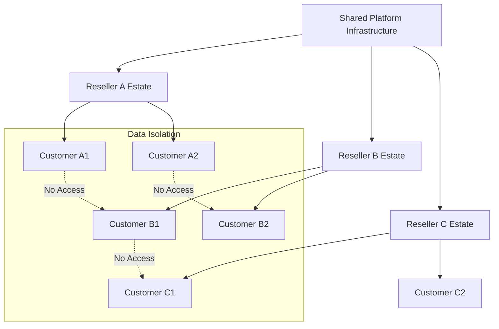
```mermaid
graph TB
    A[Shared Platform Infrastructure] --> B[Reseller A Estate]
    A --> C[Reseller B Estate] 
    A --> D[Reseller C Estate]
    
    B --> E[Customer A1]
    B --> F[Customer A2]
    C --> G[Customer B1]
    C --> H[Customer B2]
    D --> I[Customer C1]
    D --> J[Customer C2]
    
    subgraph "Data Isolation"
    E -.->|No Access| G
    F -.->|No Access| H
    G -.->|No Access| I
    end
```

### Business Isolation Requirements

#### Data Segregation Policies
- **Customer Data**: Completely isolated between resellers
- **Billing Information**: Reseller-specific visibility only
- **Performance Metrics**: Aggregated views for platform optimisation
- **Audit Trails**: Role-based access to audit information

#### Reseller Estate Management
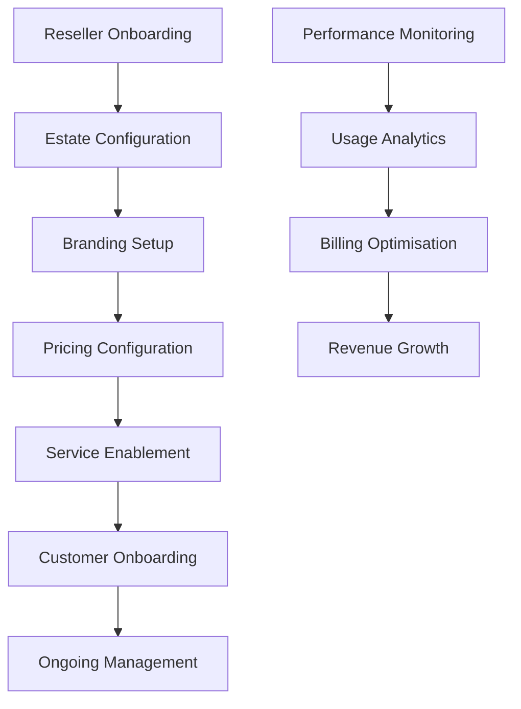
```mermaid
flowchart TD
    A[Reseller Onboarding] --> B[Estate Configuration]
    B --> C[Branding Setup]
    C --> D[Pricing Configuration]
    D --> E[Service Enablement]
    E --> F[Customer Onboarding]
    F --> G[Ongoing Management]
    
    H[Performance Monitoring] --> I[Usage Analytics]
    I --> J[Billing Optimisation]
    J --> K[Revenue Growth]
```

### Customer Relationship Management

#### Reseller-Customer Dynamics
- **Direct Relationships**: Resellers maintain direct customer relationships
- **Platform Transparency**: Customers aware of Datacentrix platform
- **Service Delivery**: Resellers responsible for customer service
- **Technical Support**: Escalation paths through reseller to Datacentrix

#### Competitive Protection
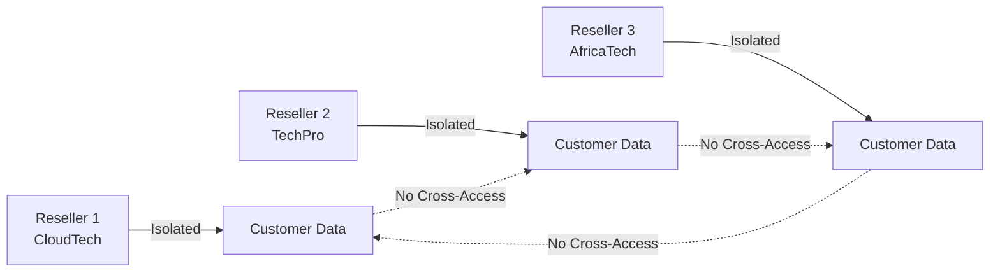
```mermaid
graph LR
    A[Reseller 1<br/>CloudTech] -->|Isolated| B[Customer Data]
    C[Reseller 2<br/>TechPro] -->|Isolated| D[Customer Data]
    E[Reseller 3<br/>AfricaTech] -->|Isolated| F[Customer Data]
    
    B -.->|No Cross-Access| D
    D -.->|No Cross-Access| F
    F -.->|No Cross-Access| B
```

### Operational Efficiency Benefits
- **Shared Infrastructure**: Lower operational costs for all participants
- **Platform Updates**: Centralised improvements benefit all tenants
- **Security Standards**: Consistent security across all tenants
- **Compliance Management**: Unified compliance framework

---

## Module 6: Platform Infrastructure - Operational Requirements

### Purpose & Scope
Platform infrastructure encompasses monitoring, alerting, configuration management, and operational procedures that ensure reliable service delivery.

### Infrastructure Monitoring Framework
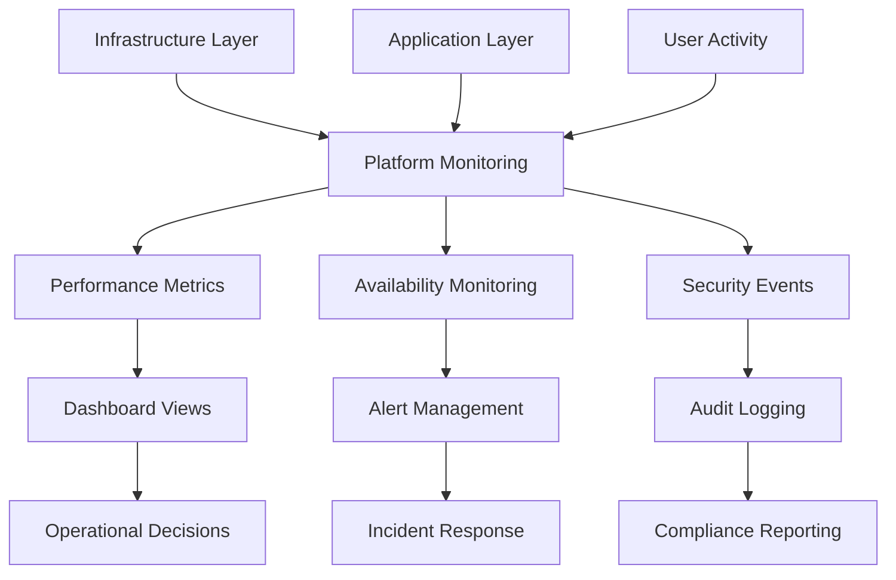
```mermaid
graph TD
    A[Infrastructure Layer] --> B[Platform Monitoring]
    C[Application Layer] --> B
    D[User Activity] --> B
    
    B --> E[Performance Metrics]
    B --> F[Availability Monitoring]
    B --> G[Security Events]
    
    E --> H[Dashboard Views]
    F --> I[Alert Management]
    G --> J[Audit Logging]
    
    H --> K[Operational Decisions]
    I --> L[Incident Response]
    J --> M[Compliance Reporting]
```

### Alert & Notification Management

#### Alert Severity Levels
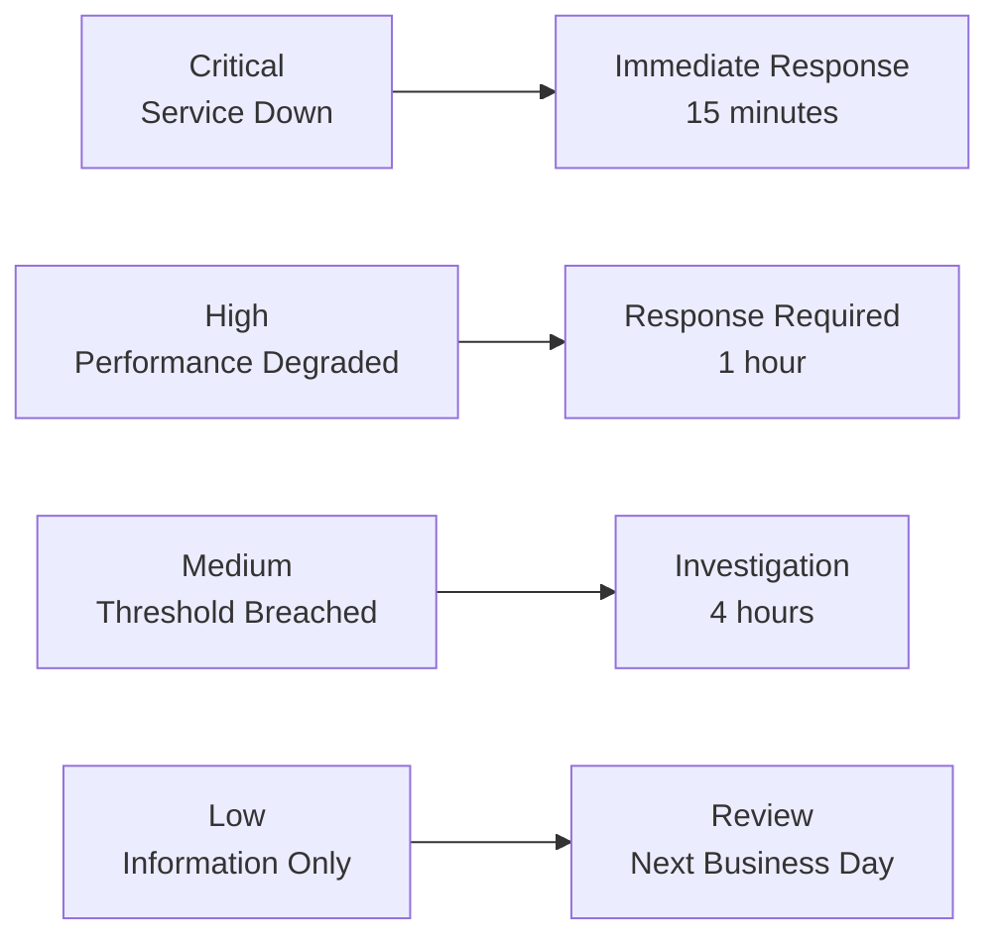
```mermaid
graph LR
    A[Critical<br/>Service Down] --> B[Immediate Response<br/>15 minutes]
    C[High<br/>Performance Degraded] --> D[Response Required<br/>1 hour]
    E[Medium<br/>Threshold Breached] --> F[Investigation<br/>4 hours]
    G[Low<br/>Information Only] --> H[Review<br/>Next Business Day]
```

#### Notification Workflows
```mermaid
sequenceDiagram
    participant System
    participant AlertEngine
    participant OnCallEngineer
    participant Customer
    
    System->>AlertEngine: Threshold Breached
    AlertEngine->>AlertEngine: Evaluate Severity
    AlertEngine->>OnCallEngineer: Send Alert
    OnCallEngineer->>System: Investigate Issue
    OnCallEngineer->>Customer: Notify if Required
    OnCallEngineer->>AlertEngine: Acknowledge Alert
```

### Configuration Management
- **Environment Configurations**: Development, staging, production settings
- **Feature Flags**: Controlled rollout of new capabilities
- **Theme Customisation**: Reseller-specific branding options
- **Service Parameters**: Configurable service delivery options

### Compliance & Audit Requirements

#### Audit Trail Management
```mermaid
flowchart TD
    A[User Actions] --> B[System Events]
    C[Data Changes] --> B
    D[Configuration Updates] --> B
    
    B --> E[Audit Log Storage]
    E --> F[Compliance Reporting]
    E --> G[Security Analysis]
    E --> H[Forensic Investigation]
    
    F --> I[Regulatory Submission]
    G --> J[Threat Detection]
    H --> K[Incident Resolution]
```

### Operational Procedures
- **Change Management**: Controlled deployment processes
- **Incident Response**: Structured problem resolution
- **Capacity Planning**: Proactive resource management
- **Business Continuity**: Disaster recovery procedures

---

## Module 7: Integration & External Systems - Business Integrations

### Purpose & Scope
Integration capabilities enable the platform to connect with external systems including payment gateways, email services, and enterprise systems.

### Integration Architecture Overview
```mermaid
graph TB
    A[DCX Cloud Platform] --> B[Payment Gateway<br/>PayStack]
    A --> C[Email Services<br/>SMTP]
    A --> D[SMS Gateway<br/>OTP Delivery]
    A --> E[Enterprise ERP<br/>Future Integration]
    
    F[Third-party APIs] --> G[VM Management APIs]
    F --> H[Monitoring Services]
    F --> I[Backup Services]
    
    A --> F
```

### Payment Gateway Integration

#### Payment Processing Flow
```mermaid
sequenceDiagram
    participant Customer
    participant Platform
    participant PayStack
    participant Bank
    
    Customer->>Platform: Initiate Payment
    Platform->>PayStack: Payment Request
    PayStack->>Customer: Redirect to Payment Page
    Customer->>PayStack: Enter Payment Details
    PayStack->>Bank: Process Transaction
    Bank->>PayStack: Transaction Result
    PayStack->>Platform: Webhook Notification
    Platform->>Customer: Payment Confirmation
```

#### Supported Payment Methods
- **Credit Cards**: Visa, MasterCard, American Express
- **Debit Cards**: Local and international debit cards
- **Bank Transfers**: Electronic funds transfer
- **Mobile Payments**: Integration capability for mobile wallets

### Communication Integration

#### Email & SMS Services
```mermaid
flowchart TD
    A[Platform Events] --> B{Communication Type}
    B -->|Email| C[SMTP Gateway]
    B -->|SMS| D[SMS Provider]
    
    C --> E[Welcome Emails]
    C --> F[Invoice Notifications]
    C --> G[Service Alerts]
    
    D --> H[OTP Delivery]
    D --> I[Critical Alerts]
    D --> J[Payment Reminders]
```

### Enterprise System Integration

#### ERP Integration Capabilities
- **Financial Data Sync**: Automated invoice and payment data transfer
- **Customer Data Management**: Synchronised customer records
- **Service Provisioning**: Automated service activation
- **Reporting Integration**: Consolidated business intelligence

#### API Management
```mermaid
graph LR
    A[External API Requests] --> B[API Gateway]
    B --> C[Authentication Layer]
    C --> D[Rate Limiting]
    D --> E[Request Routing]
    E --> F[Platform Services]
    F --> G[Response Processing]
    G --> H[External System]
```

### Data Integration & Synchronisation
- **Real-time Sync**: Critical data updates in real-time
- **Batch Processing**: Large data transfers during off-peak hours
- **Error Handling**: Retry mechanisms and failure notifications
- **Data Validation**: Integrity checks for all transferred data

---

## Module 8: Administrative Functions - Governance Procedures

### Purpose & Scope
Administrative functions provide system governance, configuration management, and operational oversight capabilities for platform administrators.

### Administrative Hierarchy
```mermaid
graph TD
    A[Root Administrator<br/>Datacentrix] --> B[Platform Configuration]
    A --> C[Reseller Management]
    A --> D[System Monitoring]
    
    E[Reseller Administrator] --> F[Customer Management]
    E --> G[Service Configuration]
    E --> H[Billing Management]
    
    I[Customer Administrator] --> J[User Management]
    I --> K[Service Consumption]
    I --> L[Account Management]
```

### System Configuration Management

#### Global Platform Settings
```mermaid
flowchart TD
    A[System Configuration] --> B[Security Settings]
    A --> C[Feature Flags]
    A --> D[Service Parameters]
    A --> E[Integration Config]
    
    B --> F[Password Policies]
    B --> G[Session Timeouts]
    B --> H[Access Controls]
    
    C --> I[New Feature Rollout]
    C --> J[Beta Feature Access]
    C --> K[Maintenance Mode]
```

#### User & Permission Management
- **Role Templates**: Pre-configured role definitions
- **Permission Inheritance**: Hierarchical permission structures
- **Delegation Authority**: Who can assign roles to whom
- **Access Reviews**: Regular permission audits

### Platform Monitoring & Diagnostics

#### Health Monitoring Dashboard
```mermaid
pie title System Health Metrics
    "Application Performance" : 25
    "Database Performance" : 25
    "Infrastructure Health" : 25
    "User Experience" : 25
```

#### Diagnostic Procedures
```mermaid
sequenceDiagram
    participant Admin
    participant Platform
    participant DiagnosticEngine
    participant Database
    
    Admin->>Platform: Request System Health
    Platform->>DiagnosticEngine: Run Health Checks
    DiagnosticEngine->>Database: Query Performance Metrics
    Database->>DiagnosticEngine: Return Metrics
    DiagnosticEngine->>Platform: Compile Health Report
    Platform->>Admin: Display Health Dashboard
```

### Governance & Compliance Procedures
- **Change Approval Workflows**: Multi-level approval for system changes
- **Audit Procedures**: Regular compliance audits and reviews
- **Documentation Management**: Maintaining up-to-date documentation
- **Training & Certification**: User training programmes

### Business Continuity & Risk Management
- **Backup Procedures**: Regular system and data backups
- **Disaster Recovery**: Documented recovery procedures
- **Risk Assessment**: Regular risk evaluation and mitigation
- **Business Impact Analysis**: Understanding critical system dependencies

---

## Business Continuity & Compliance

### Disaster Recovery Procedures
```mermaid
flowchart TD
    A[Disaster Event] --> B[Incident Detection]
    B --> C[Damage Assessment]
    C --> D{System Impact}
    
    D -->|Minor| E[Standard Recovery]
    D -->|Major| F[Full DR Activation]
    
    E --> G[Service Restoration]
    F --> H[Failover to DR Site]
    H --> I[Customer Notification]
    I --> J[Service Restoration]
    
    G --> K[Post-Incident Review]
    J --> K
```

### Compliance Framework
- **Data Protection**: GDPR and local data protection compliance
- **Financial Regulations**: Payment card industry compliance
- **Security Standards**: ISO 27001 security management
- **Audit Requirements**: Regular internal and external audits

### Risk Management Matrix
| Risk Category | Impact | Probability | Mitigation Strategy |
|---------------|---------|-------------|-------------------|
| Data Breach | High | Low | Multi-factor authentication, encryption |
| System Outage | High | Medium | Redundant systems, disaster recovery |
| Payment Fraud | Medium | Medium | PCI compliance, fraud detection |
| Regulatory Non-compliance | High | Low | Regular audits, compliance monitoring |

---

## Operational Excellence Framework

### Key Performance Indicators

#### Service Delivery KPIs
- **System Availability**: 99.9% uptime target
- **Response Time**: <2 seconds for web interface
- **API Performance**: <200ms average response time
- **Customer Satisfaction**: >95% satisfaction score

#### Business Performance KPIs
- **Revenue Growth**: Quarter-over-quarter growth targets
- **Customer Retention**: >98% annual retention rate
- **Reseller Performance**: Commission achievement metrics
- **Cost Optimisation**: Infrastructure cost per customer

### Continuous Improvement Process
- **Monthly Performance Reviews**: Analyse KPIs and metrics
- **Quarterly Business Reviews**: Strategic planning sessions
- **Annual Platform Assessment**: Comprehensive platform evaluation
- **Customer Feedback Integration**: Regular customer input incorporation

### Quality Assurance Framework
- **Automated Testing**: Continuous integration testing
- **Manual Testing**: User acceptance testing protocols
- **Performance Testing**: Load and stress testing procedures
- **Security Testing**: Regular penetration testing

---

*This document represents the complete business specification for the DCX Cloud Platform. It should be reviewed quarterly and updated as business requirements evolve.*