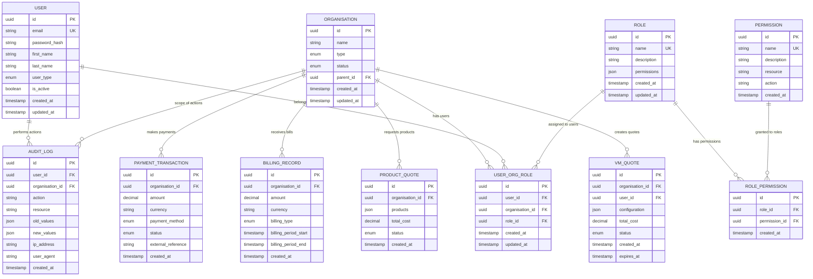

# DCX Cloud Platform - Complete Technical Specification

## System Architecture & Technology Stack

### High-Level Architecture Overview


### Technology Stack Components

#### Frontend Technologies


#### Backend & Infrastructure
- **API Server**: Express.js with TypeScript
- **Database**: PostgreSQL 16.9 with multi-database architecture
- **Authentication**: JWT tokens with refresh token rotation
- **Session Management**: Redis-backed sessions
- **Payment Processing**: PayStack integration
- **Email Services**: SMTP integration
- **Monitoring**: Application performance monitoring

### Component Architecture Diagram


### Deployment Architecture


---

## Database Schema & Data Architecture

### Complete Entity Relationship Diagram


### Multi-Database Architecture


### Data Flow Architecture


---

## Module 1: Authentication & Access - Implementation

### Authentication System Architecture


### JWT Token Structure
```typescript
interface JWTPayload {
  sub: string;           // User ID
  email: string;         // User email
  userType: UserType;    // Customer | Reseller | Internal
  organizations: Array<{
    id: string;
    name: string;
    type: OrganisationType;
    roles: string[];
  }>;
  permissions: string[]; // Flattened permissions
  iat: number;          // Issued at
  exp: number;          // Expires at
  jti: string;          // JWT ID for revocation
}
```

### Role-Based Access Control Implementation
```typescript
// Permission Service Implementation
class PermissionService {
  /**
   * Checks if user has permission for specific action on resource
   */
  public hasPermission(
    user: IUser,
    action: string,
    resource: string,
    organizationId?: string
  ): boolean {
    // Get user's roles for the organization
    const userRoles = this.getUserRoles(user.id, organizationId);
    
    // Check each role for the required permission
    return userRoles.some(role => 
      role.permissions.some(permission => 
        permission.action === action && 
        permission.resource === resource
      )
    );
  }
  
  /**
   * Gets organizations accessible by user based on their roles
   */
  public getAccessibleOrganizations(user: IUser): Organization[] {
    switch (user.userType) {
      case UserType.Internal:
        return this.getAllOrganizations(); // God mode access
      case UserType.Reseller:
        return this.getResellerEstate(user.id);
      case UserType.Customer:
        return this.getUserOrganizations(user.id);
      default:
        return [];
    }
  }
}
```

### Multi-Factor Authentication Flow


### Session Management Implementation
```typescript
// Auth Store with Zustand
interface AuthState {
  user: IUser | null;
  token: string | null;
  refreshToken: string | null;
  isAuthenticated: boolean;
  organizations: Organization[];
  currentOrganization: Organization | null;
}

const useAuthStore = create<AuthState & AuthActions>(
  persist(
    (set, get) => ({
      user: null,
      token: null,
      refreshToken: null,
      isAuthenticated: false,
      organizations: [],
      currentOrganization: null,
      
      login: async (credentials: LoginCredentials) => {
        const response = await authService.login(credentials);
        set({
          user: response.user,
          token: response.token,
          refreshToken: response.refreshToken,
          isAuthenticated: true,
          organizations: response.user.organizations
        });
      },
      
      logout: () => {
        set({
          user: null,
          token: null,
          refreshToken: null,
          isAuthenticated: false,
          organizations: [],
          currentOrganization: null
        });
      },
      
      refreshToken: async () => {
        const { refreshToken } = get();
        if (!refreshToken) throw new Error('No refresh token available');
        
        const response = await authService.refresh(refreshToken);
        set({
          token: response.token,
          refreshToken: response.refreshToken
        });
      }
    }),
    {
      name: 'dcx-auth-store',
      storage: createJSONStorage(() => ({
        getItem: (key) => Cookies.get(key) || null,
        setItem: (key, value) => Cookies.set(key, value, { 
          secure: true, 
          sameSite: 'strict',
          expires: 7 // 7 days
        }),
        removeItem: (key) => Cookies.remove(key)
      }))
    }
  )
);
```

### Security Implementation Details

#### Password Security
```typescript
// Password hashing with bcrypt
const hashPassword = async (password: string): Promise<string> => {
  const saltRounds = 12;
  return await bcrypt.hash(password, saltRounds);
};

// Password validation rules
const passwordValidation = {
  minLength: 8,
  requireUppercase: true,
  requireLowercase: true,
  requireNumbers: true,
  requireSpecialChars: true,
  preventCommonPasswords: true
};
```

#### Session Security
```typescript
// JWT configuration
const jwtConfig = {
  accessTokenExpiry: '15m',
  refreshTokenExpiry: '7d',
  algorithm: 'RS256',
  issuer: 'dcx-cloud-platform',
  audience: 'dcx-users'
};

// Rate limiting for authentication
const authRateLimit = {
  windowMs: 15 * 60 * 1000, // 15 minutes
  max: 5, // Limit each IP to 5 requests per window
  message: 'Too many login attempts, please try again later',
  standardHeaders: true,
  legacyHeaders: false
};
```

---

## Module 2: User & Organisation Management - Code Structure

### Component Architecture


### User Management Implementation
```typescript
// User Management Dashboard Component
interface UserManagementDashboardProps {
  organizationId?: string;
  currentUser: IUser;
}

const UserManagementDashboard: React.FC<UserManagementDashboardProps> = ({
  organizationId,
  currentUser
}) => {
  const [users, setUsers] = useState<IUser[]>([]);
  const [selectedUser, setSelectedUser] = useState<IUser | null>(null);
  const [showInviteForm, setShowInviteForm] = useState(false);
  
  // Get accessible organizations based on user role
  const accessibleOrgs = useMemo(() => {
    return permissionService.getAccessibleOrganizations(currentUser);
  }, [currentUser]);
  
  // Load users based on organization scope
  useEffect(() => {
    const loadUsers = async () => {
      try {
        if (organizationId) {
          const orgUsers = await userService.getOrganizationUsers(organizationId);
          setUsers(orgUsers);
        } else {
          // Load all accessible users for admin
          const allUsers = await userService.getAccessibleUsers(currentUser);
          setUsers(allUsers);
        }
      } catch (error) {
        console.error('Failed to load users:', error);
      }
    };
    
    loadUsers();
  }, [organizationId, currentUser]);
  
  const handleInviteUser = async (inviteData: UserInviteData) => {
    try {
      await userService.inviteUser({
        ...inviteData,
        organizationId: organizationId || currentUser.defaultOrganization,
        invitedBy: currentUser.id
      });
      
      // Refresh user list
      const updatedUsers = await userService.getOrganizationUsers(organizationId);
      setUsers(updatedUsers);
      setShowInviteForm(false);
    } catch (error) {
      console.error('Failed to invite user:', error);
    }
  };
  
  return (
    <div className="user-management-dashboard">
      <UserManagementHeader 
        onInviteUser={() => setShowInviteForm(true)}
        canInvite={permissionService.hasPermission(
          currentUser, 
          'CREATE', 
          'USER', 
          organizationId
        )}
      />
      
      <UserTable 
        users={users}
        currentUser={currentUser}
        onSelectUser={setSelectedUser}
        organizationId={organizationId}
      />
      
      {showInviteForm && (
        <UserInviteForm
          onSubmit={handleInviteUser}
          onCancel={() => setShowInviteForm(false)}
          availableRoles={getAvailableRoles(currentUser, organizationId)}
        />
      )}
      
      {selectedUser && (
        <UserDetailsPanel
          user={selectedUser}
          currentUser={currentUser}
          onClose={() => setSelectedUser(null)}
          onUserUpdated={(updatedUser) => {
            setUsers(users.map(u => u.id === updatedUser.id ? updatedUser : u));
          }}
        />
      )}
    </div>
  );
};
```

### Organization Access Service
```typescript
// Organization Access Service
class OrganizationAccessService {
  /**
   * Gets organization tree for user based on their access level
   */
  public async getOrganizationTree(userId: string): Promise<OrganizationTreeNode[]> {
    const user = await this.userRepository.findById(userId);
    if (!user) throw new Error('User not found');
    
    switch (user.userType) {
      case UserType.Internal:
        return this.getFullOrganizationTree();
      case UserType.Reseller:
        return this.getResellerOrganizationTree(userId);
      case UserType.Customer:
        return this.getCustomerOrganizationTree(userId);
      default:
        return [];
    }
  }
  
  /**
   * Checks if user can access specific organization
   */
  public async canAccessOrganization(
    userId: string, 
    organizationId: string
  ): Promise<boolean> {
    const userOrgs = await this.getUserOrganizations(userId);
    return userOrgs.some(org => 
      org.id === organizationId || 
      this.isParentOrganization(org.id, organizationId)
    );
  }
  
  /**
   * Gets users that the current user can manage
   */
  public async getManageableUsers(currentUserId: string): Promise<IUser[]> {
    const currentUser = await this.userRepository.findById(currentUserId);
    const accessibleOrgs = await this.getOrganizationTree(currentUserId);
    
    const orgIds = this.flattenOrganizationIds(accessibleOrgs);
    return this.userRepository.findByOrganizations(orgIds);
  }
  
  private async getResellerOrganizationTree(userId: string): Promise<OrganizationTreeNode[]> {
    // Get reseller organization and all customer organizations
    const resellerOrgs = await this.organizationRepository.findByUserId(userId);
    const customerOrgs = await this.organizationRepository.findCustomersForReseller(userId);
    
    return this.buildTree(resellerOrgs.concat(customerOrgs));
  }
}
```

### User Invitation System


### Role Assignment Implementation
```typescript
// Role Assignment Component
interface UserRoleAssignmentProps {
  user: IUser;
  organization: Organization;
  currentUser: IUser;
  onRolesUpdated: (roles: Role[]) => void;
}

const UserRoleAssignment: React.FC<UserRoleAssignmentProps> = ({
  user,
  organization,
  currentUser,
  onRolesUpdated
}) => {
  const [availableRoles, setAvailableRoles] = useState<Role[]>([]);
  const [assignedRoles, setAssignedRoles] = useState<Role[]>([]);
  const [loading, setLoading] = useState(false);
  
  useEffect(() => {
    const loadRoles = async () => {
      try {
        // Get roles that current user can assign
        const available = await roleService.getAssignableRoles(
          currentUser.id,
          organization.id
        );
        setAvailableRoles(available);
        
        // Get user's current roles in this organization
        const current = await roleService.getUserRoles(
          user.id,
          organization.id
        );
        setAssignedRoles(current);
      } catch (error) {
        console.error('Failed to load roles:', error);
      }
    };
    
    loadRoles();
  }, [user.id, organization.id, currentUser.id]);
  
  const handleRoleAssignment = async (roleId: string, assign: boolean) => {
    setLoading(true);
    try {
      if (assign) {
        await roleService.assignRole(user.id, organization.id, roleId);
      } else {
        await roleService.unassignRole(user.id, organization.id, roleId);
      }
      
      // Refresh assigned roles
      const updatedRoles = await roleService.getUserRoles(
        user.id,
        organization.id
      );
      setAssignedRoles(updatedRoles);
      onRolesUpdated(updatedRoles);
    } catch (error) {
      console.error('Failed to update role assignment:', error);
    } finally {
      setLoading(false);
    }
  };
  
  return (
    <div className="role-assignment-panel">
      <h3>Role Assignment for {user.firstName} {user.lastName}</h3>
      <div className="organization-context">
        Organization: {organization.name}
      </div>
      
      <div className="role-list">
        {availableRoles.map(role => {
          const isAssigned = assignedRoles.some(ar => ar.id === role.id);
          return (
            <div key={role.id} className="role-item">
              <Checkbox
                checked={isAssigned}
                onChange={(e) => handleRoleAssignment(role.id, e.target.checked)}
                disabled={loading}
              />
              <div className="role-info">
                <div className="role-name">{role.name}</div>
                <div className="role-description">{role.description}</div>
              </div>
            </div>
          );
        })}
      </div>
    </div>
  );
};
```

---

## Module 3: Core Platform Services - Technical Implementation

### Service Architecture Overview


### Virtual Machine Management Implementation
```typescript
// VM Configuration Store
interface VMState {
  currentConfiguration: IVMConfig | null;
  templates: VMTemplate[];
  selectedServices: IAdditionalServices[];
  backupConfig: IBackupServices | null;
  softwareLicenses: ISoftwareLicense[];
  pricing: VMPricing | null;
}

const useVirtualMachineStore = create<VMState & VMActions>((set, get) => ({
  currentConfiguration: null,
  templates: [],
  selectedServices: [],
  backupConfig: null,
  softwareLicenses: [],
  pricing: null,
  
  setConfiguration: (config: IVMConfig) => set({ currentConfiguration: config }),
  
  selectTemplate: (template: VMTemplate) => {
    const config: IVMConfig = {
      ...template,
      customizations: {},
      selectedAt: new Date().toISOString()
    };
    set({ currentConfiguration: config });
  },
  
  updateResourceConfig: (resources: Partial<IVMConfig>) => {
    const current = get().currentConfiguration;
    if (current) {
      set({
        currentConfiguration: {
          ...current,
          ...resources,
          updatedAt: new Date().toISOString()
        }
      });
    }
  },
  
  calculatePricing: async () => {
    const { currentConfiguration, selectedServices, backupConfig } = get();
    if (!currentConfiguration) return;
    
    try {
      const pricing = await vmPricingService.calculateTotalCost({
        vmConfig: currentConfiguration,
        additionalServices: selectedServices,
        backupServices: backupConfig
      });
      
      set({ pricing });
    } catch (error) {
      console.error('Failed to calculate pricing:', error);
    }
  },
  
  submitConfiguration: async (organizationId: string) => {
    const state = get();
    if (!state.currentConfiguration) throw new Error('No configuration selected');
    
    const quote = await vmService.createQuote({
      organizationId,
      configuration: state.currentConfiguration,
      additionalServices: state.selectedServices,
      backupConfig: state.backupConfig,
      softwareLicenses: state.softwareLicenses,
      estimatedCost: state.pricing?.total || 0
    });
    
    return quote;
  }
}));
```

### VM Provisioning Workflow


### Dashboard Data Processing
```typescript
// Customer Dashboard Data Service
class DashboardDataService {
  /**
   * Aggregates VM telemetry data for dashboard display
   */
  public async getVMTelemetryData(
    organizationId: string,
    timeRange: TimeRange
  ): Promise<VMTelemetryAggregated> {
    try {
      // Fetch raw telemetry data
      const rawData = await this.telemetryAPI.getVMData({
        organizationId,
        startTime: timeRange.start,
        endTime: timeRange.end
      });
      
      // Process and aggregate data
      const aggregated = this.aggregateTelemetryData(rawData);
      
      // Apply organization-specific filtering
      const filtered = this.filterByOrganizationAccess(aggregated, organizationId);
      
      return {
        summary: this.generateSummaryMetrics(filtered),
        timeSeries: this.generateTimeSeriesData(filtered),
        alerts: this.generateAlertData(filtered),
        recommendations: this.generateRecommendations(filtered)
      };
    } catch (error) {
      console.error('Failed to fetch VM telemetry:', error);
      throw new Error('Unable to load dashboard data');
    }
  }
  
  /**
   * Processes billing data for financial dashboard
   */
  public async getBillingAnalytics(
    organizationId: string,
    period: BillingPeriod
  ): Promise<BillingAnalytics> {
    const billingData = await this.billingAPI.getBillingHistory({
      organizationId,
      period
    });
    
    return {
      currentPeriod: this.calculateCurrentPeriodCosts(billingData),
      trends: this.calculateTrends(billingData),
      breakdown: this.generateCostBreakdown(billingData),
      projections: this.generateCostProjections(billingData)
    };
  }
  
  private aggregateTelemetryData(rawData: VMTelemetryRaw[]): VMTelemetryAggregated {
    // Group by VM and time intervals
    const grouped = rawData.reduce((acc, dataPoint) => {
      const key = `${dataPoint.vmId}_${dataPoint.timestamp}`;
      acc[key] = dataPoint;
      return acc;
    }, {} as Record<string, VMTelemetryRaw>);
    
    // Calculate aggregations
    return {
      totalVMs: new Set(rawData.map(d => d.vmId)).size,
      avgCpuUsage: this.calculateAverage(rawData, 'cpuUsage'),
      avgMemoryUsage: this.calculateAverage(rawData, 'memoryUsage'),
      totalDataTransfer: this.calculateSum(rawData, 'networkIO'),
      performanceScore: this.calculatePerformanceScore(rawData)
    };
  }
}
```

---

## Module 4: Financial & Commercial System - System Logic

### Payment Processing Architecture


### Pricing Calculation Engine
```typescript
// Pricing Engine Implementation
class PricingEngine {
  private pricingRules: PricingRule[];
  private discountEngine: DiscountEngine;
  
  constructor(
    pricingRules: PricingRule[],
    discountEngine: DiscountEngine
  ) {
    this.pricingRules = pricingRules;
    this.discountEngine = discountEngine;
  }
  
  /**
   * Calculates total cost for VM configuration with all applicable discounts
   */
  public async calculateVMCost(
    config: IVMConfig,
    additionalServices: IAdditionalServices[],
    organizationId: string,
    billingPeriod: BillingPeriod = 'monthly'
  ): Promise<PricingCalculation> {
    // Base VM costs
    const baseCosts = this.calculateBaseCosts(config, billingPeriod);
    
    // Additional service costs
    const serviceCosts = this.calculateServiceCosts(additionalServices, billingPeriod);
    
    // Get organization pricing tier
    const pricingTier = await this.getPricingTier(organizationId);
    
    // Apply tier-based pricing
    const tierAdjustedCosts = this.applyTierPricing(
      baseCosts + serviceCosts,
      pricingTier
    );
    
    // Calculate volume discounts
    const volumeDiscounts = await this.discountEngine.calculateVolumeDiscounts(
      organizationId,
      tierAdjustedCosts,
      billingPeriod
    );
    
    // Apply promotional discounts
    const promotionalDiscounts = await this.discountEngine.calculatePromotionalDiscounts(
      organizationId,
      tierAdjustedCosts
    );
    
    const totalDiscounts = volumeDiscounts + promotionalDiscounts;
    const finalCost = Math.max(0, tierAdjustedCosts - totalDiscounts);
    
    return {
      baseCost: baseCosts,
      serviceCosts: serviceCosts,
      tierAdjustment: tierAdjustedCosts - (baseCosts + serviceCosts),
      volumeDiscount: volumeDiscounts,
      promotionalDiscount: promotionalDiscounts,
      totalDiscount: totalDiscounts,
      finalCost: finalCost,
      currency: 'ZAR',
      billingPeriod,
      calculatedAt: new Date().toISOString()
    };
  }
  
  private calculateBaseCosts(config: IVMConfig, period: BillingPeriod): number {
    const hourlyRate = this.calculateHourlyRate(config);
    
    switch (period) {
      case 'hourly':
        return hourlyRate;
      case 'monthly':
        return hourlyRate * 24 * 30; // 720 hours
      case 'annually':
        return hourlyRate * 24 * 365; // 8760 hours
      default:
        throw new Error(`Unsupported billing period: ${period}`);
    }
  }
  
  private calculateHourlyRate(config: IVMConfig): number {
    const cpuCost = config.cpu * this.getResourcePrice('cpu');
    const memoryCost = config.memory * this.getResourcePrice('memory');
    const storageCost = config.storage * this.getResourcePrice('storage');
    const networkCost = config.bandwidth * this.getResourcePrice('bandwidth');
    
    return cpuCost + memoryCost + storageCost + networkCost;
  }
  
  private getResourcePrice(resource: ResourceType): number {
    const rule = this.pricingRules.find(r => r.resource === resource);
    if (!rule) throw new Error(`No pricing rule found for resource: ${resource}`);
    return rule.pricePerUnit;
  }
}

// Discount Engine Implementation
class DiscountEngine {
  /**
   * Calculates volume-based discounts for organization
   */
  public async calculateVolumeDiscounts(
    organizationId: string,
    baseCost: number,
    period: BillingPeriod
  ): Promise<number> {
    const usage = await this.getOrganizationUsage(organizationId, period);
    const volumeTier = this.determineVolumeTier(usage.totalSpend);
    
    const discountPercentage = this.getVolumeDiscountPercentage(volumeTier);
    return baseCost * (discountPercentage / 100);
  }
  
  /**
   * Calculates promotional discounts for organization
   */
  public async calculatePromotionalDiscounts(
    organizationId: string,
    baseCost: number
  ): Promise<number> {
    const activePromotions = await this.getActivePromotions(organizationId);
    
    let totalDiscount = 0;
    for (const promotion of activePromotions) {
      const discount = this.calculatePromotionDiscount(promotion, baseCost);
      totalDiscount += discount;
    }
    
    return Math.min(totalDiscount, baseCost * 0.5); // Max 50% discount
  }
  
  private determineVolumeTier(totalSpend: number): VolumeTier {
    if (totalSpend >= 100000) return 'enterprise';
    if (totalSpend >= 50000) return 'business';
    if (totalSpend >= 10000) return 'professional';
    return 'standard';
  }
  
  private getVolumeDiscountPercentage(tier: VolumeTier): number {
    const discounts = {
      standard: 0,
      professional: 5,
      business: 10,
      enterprise: 15
    };
    return discounts[tier];
  }
}
```

### Billing Cycle Implementation
```typescript
// Billing Service Implementation
class BillingService {
  /**
   * Processes monthly billing for all organizations
   */
  public async processMonthlyBilling(): Promise<BillingResult[]> {
    const organizations = await this.getActiveOrganizations();
    const results: BillingResult[] = [];
    
    for (const org of organizations) {
      try {
        const result = await this.processOrganizationBilling(org.id);
        results.push(result);
      } catch (error) {
        console.error(`Failed to process billing for ${org.name}:`, error);
        results.push({
          organizationId: org.id,
          success: false,
          error: error.message
        });
      }
    }
    
    return results;
  }
  
  private async processOrganizationBilling(organizationId: string): Promise<BillingResult> {
    // Get usage data for billing period
    const usageData = await this.getUsageData(organizationId);
    
    // Calculate costs
    const costs = await this.calculateMonthlyCosts(organizationId, usageData);
    
    // Generate invoice
    const invoice = await this.generateInvoice({
      organizationId,
      billingPeriod: this.getCurrentBillingPeriod(),
      lineItems: costs.lineItems,
      totalAmount: costs.total,
      dueDate: this.calculateDueDate()
    });
    
    // Send invoice
    await this.sendInvoice(invoice);
    
    // Update billing status
    await this.updateBillingStatus(organizationId, 'invoiced');
    
    return {
      organizationId,
      success: true,
      invoiceId: invoice.id,
      amount: costs.total
    };
  }
  
  /**
   * Processes payment webhook from PayStack
   */
  public async processPaymentWebhook(webhookData: PayStackWebhook): Promise<void> {
    const { event, data } = webhookData;
    
    switch (event) {
      case 'charge.success':
        await this.handleSuccessfulPayment(data);
        break;
      case 'charge.failed':
        await this.handleFailedPayment(data);
        break;
      case 'transfer.success':
        await this.handleTransferSuccess(data);
        break;
      default:
        console.warn(`Unhandled webhook event: ${event}`);
    }
  }
  
  private async handleSuccessfulPayment(paymentData: PayStackPaymentData): Promise<void> {
    const payment = await this.paymentRepository.findByReference(
      paymentData.reference
    );
    
    if (!payment) {
      throw new Error(`Payment not found: ${paymentData.reference}`);
    }
    
    // Update payment status
    await this.paymentRepository.updateStatus(payment.id, 'completed');
    
    // Update organization credit balance
    await this.creditService.addCredit(
      payment.organizationId,
      paymentData.amount / 100, // Convert from kobo to naira
      `Payment via ${paymentData.channel}`
    );
    
    // Send confirmation email
    await this.emailService.sendPaymentConfirmation(
      payment.organizationId,
      paymentData
    );
    
    // Update invoice if payment was for specific invoice
    if (payment.invoiceId) {
      await this.invoiceService.markAsPaid(payment.invoiceId, payment.id);
    }
  }
}
```

---

## Module 5: Multi-Tenant Architecture - Technical Design

### Tenant Isolation Architecture


### Multi-Tenant Data Access Implementation
```typescript
// Tenant Context Middleware
interface TenantContext {
  userId: string;
  userType: UserType;
  organizationId: string;
  accessibleOrganizations: string[];
  permissions: string[];
}

class TenantContextMiddleware {
  public async extractTenantContext(req: Request): Promise<TenantContext> {
    const token = this.extractToken(req);
    const payload = await this.verifyToken(token);
    
    // Get user's accessible organizations
    const accessibleOrgs = await this.getAccessibleOrganizations(
      payload.sub,
      payload.userType
    );
    
    // Determine current organization context
    const currentOrgId = req.headers['x-organization-id'] as string || 
                         payload.organizations[0]?.id;
    
    // Validate organization access
    if (currentOrgId && !accessibleOrgs.includes(currentOrgId)) {
      throw new UnauthorizedError('Organization access denied');
    }
    
    return {
      userId: payload.sub,
      userType: payload.userType,
      organizationId: currentOrgId,
      accessibleOrganizations: accessibleOrgs,
      permissions: payload.permissions
    };
  }
  
  private async getAccessibleOrganizations(
    userId: string,
    userType: UserType
  ): Promise<string[]> {
    switch (userType) {
      case UserType.Internal:
        // Internal users have access to all organizations
        return this.getAllOrganizationIds();
        
      case UserType.Reseller:
        // Reseller users have access to their estate
        return this.getResellerEstate(userId);
        
      case UserType.Customer:
        // Customer users have access to their organizations only
        return this.getUserOrganizations(userId);
        
      default:
        return [];
    }
  }
}

// Organization-Scoped Repository Base Class
abstract class OrganizationScopedRepository<T> {
  protected tenantContext: TenantContext;
  
  constructor(tenantContext: TenantContext) {
    this.tenantContext = tenantContext;
  }
  
  /**
   * Applies organization-based filtering to all queries
   */
  protected applyOrganizationFilter(query: QueryBuilder<T>): QueryBuilder<T> {
    // For internal users, no filtering needed (god mode)
    if (this.tenantContext.userType === UserType.Internal) {
      return query;
    }
    
    // For reseller and customer users, apply organization filtering
    return query.whereIn(
      'organization_id',
      this.tenantContext.accessibleOrganizations
    );
  }
  
  /**
   * Validates that the entity belongs to an accessible organization
   */
  protected async validateOrganizationAccess(
    entityOrganizationId: string
  ): Promise<void> {
    if (this.tenantContext.userType === UserType.Internal) {
      return; // Internal users have access to everything
    }
    
    if (!this.tenantContext.accessibleOrganizations.includes(entityOrganizationId)) {
      throw new UnauthorizedError(
        'Access denied: Entity belongs to inaccessible organization'
      );
    }
  }
  
  public async findById(id: string): Promise<T | null> {
    const entity = await this.createQueryBuilder()
      .where('id', id)
      .pipe(this.applyOrganizationFilter.bind(this))
      .first();
    
    return entity || null;
  }
  
  public async findAll(): Promise<T[]> {
    return this.createQueryBuilder()
      .pipe(this.applyOrganizationFilter.bind(this))
      .orderBy('created_at', 'desc');
  }
  
  protected abstract createQueryBuilder(): QueryBuilder<T>;
}
```

---

## Module 6: Platform Infrastructure - System Components

### Infrastructure Monitoring Architecture


### Notification System Implementation
```typescript
// Notification Store Implementation
interface NotificationState {
  notifications: INotification[];
  unreadCount: number;
  settings: NotificationSettings;
  loading: boolean;
}

const useNotificationStore = create<NotificationState & NotificationActions>(
  (set, get) => ({
    notifications: [],
    unreadCount: 0,
    settings: {
      emailNotifications: true,
      pushNotifications: true,
      smsNotifications: false,
      alertTypes: ['critical', 'warning', 'info']
    },
    loading: false,
    
    loadNotifications: async (organizationId: string) => {
      set({ loading: true });
      try {
        const notifications = await notificationService.getNotifications(organizationId);
        const unreadCount = notifications.filter(n => !n.read).length;
        
        set({ 
          notifications, 
          unreadCount, 
          loading: false 
        });
      } catch (error) {
        console.error('Failed to load notifications:', error);
        set({ loading: false });
      }
    },
    
    markAsRead: async (notificationId: string) => {
      try {
        await notificationService.markAsRead(notificationId);
        
        const notifications = get().notifications.map(n =>
          n.id === notificationId ? { ...n, read: true } : n
        );
        const unreadCount = notifications.filter(n => !n.read).length;
        
        set({ notifications, unreadCount });
      } catch (error) {
        console.error('Failed to mark notification as read:', error);
      }
    },
    
    markAllAsRead: async (organizationId: string) => {
      try {
        await notificationService.markAllAsRead(organizationId);
        
        const notifications = get().notifications.map(n => ({ ...n, read: true }));
        set({ notifications, unreadCount: 0 });
      } catch (error) {
        console.error('Failed to mark all notifications as read:', error);
      }
    },
    
    addNotification: (notification: INotification) => {
      const notifications = [notification, ...get().notifications];
      const unreadCount = notifications.filter(n => !n.read).length;
      set({ notifications, unreadCount });
    }
  })
);
```

### Alert Management System
```typescript
// Alert Engine Implementation
class AlertEngine {
  private alertRules: AlertRule[];
  private notificationService: NotificationService;
  
  constructor(
    alertRules: AlertRule[],
    notificationService: NotificationService
  ) {
    this.alertRules = alertRules;
    this.notificationService = notificationService;
  }
  
  /**
   * Processes incoming metrics and triggers alerts
   */
  public async processMetrics(metrics: SystemMetrics): Promise<void> {
    for (const rule of this.alertRules) {
      try {
        const shouldAlert = await this.evaluateRule(rule, metrics);
        
        if (shouldAlert) {
          await this.triggerAlert(rule, metrics);
        }
      } catch (error) {
        console.error(`Failed to evaluate alert rule ${rule.id}:`, error);
      }
    }
  }
  
  private async evaluateRule(rule: AlertRule, metrics: SystemMetrics): Promise<boolean> {
    switch (rule.type) {
      case 'threshold':
        return this.evaluateThresholdRule(rule as ThresholdRule, metrics);
      case 'rate':
        return this.evaluateRateRule(rule as RateRule, metrics);
      case 'availability':
        return this.evaluateAvailabilityRule(rule as AvailabilityRule, metrics);
      default:
        console.warn(`Unknown alert rule type: ${rule.type}`);
        return false;
    }
  }
  
  private evaluateThresholdRule(rule: ThresholdRule, metrics: SystemMetrics): boolean {
    const metricValue = this.getMetricValue(metrics, rule.metricPath);
    
    switch (rule.operator) {
      case 'greater_than':
        return metricValue > rule.threshold;
      case 'less_than':
        return metricValue < rule.threshold;
      case 'equal_to':
        return metricValue === rule.threshold;
      default:
        return false;
    }
  }
  
  private async triggerAlert(rule: AlertRule, metrics: SystemMetrics): Promise<void> {
    // Check if alert is in cooldown period
    const lastAlert = await this.getLastAlert(rule.id);
    if (lastAlert && this.isInCooldown(lastAlert, rule.cooldownPeriod)) {
      return;
    }
    
    // Create alert record
    const alert = await this.createAlert({
      ruleId: rule.id,
      severity: rule.severity,
      title: rule.title,
      message: this.formatAlertMessage(rule, metrics),
      organizationId: rule.organizationId,
      metadata: {
        metricValues: this.extractRelevantMetrics(metrics, rule),
        ruleConfiguration: rule
      }
    });
    
    // Send notifications based on severity and recipient configuration
    await this.sendAlertNotifications(alert, rule.recipients);
    
    // Record alert in database
    await this.recordAlert(alert);
  }
}
```

### Configuration Management System
```typescript
// Configuration Service
class ConfigurationService {
  private configCache: Map<string, any> = new Map();
  private configWatchers: Map<string, ConfigWatcher[]> = new Map();
  
  /**
   * Gets configuration value with environment override support
   */
  public async getConfig<T>(key: string, defaultValue?: T): Promise<T> {
    // Check cache first
    if (this.configCache.has(key)) {
      return this.configCache.get(key);
    }
    
    // Try environment variable first
    const envValue = process.env[key.replace('.', '_').toUpperCase()];
    if (envValue !== undefined) {
      const parsedValue = this.parseEnvironmentValue(envValue);
      this.configCache.set(key, parsedValue);
      return parsedValue;
    }
    
    // Try database configuration
    const dbValue = await this.getConfigFromDatabase(key);
    if (dbValue !== null) {
      this.configCache.set(key, dbValue);
      return dbValue;
    }
    
    // Return default value
    if (defaultValue !== undefined) {
      this.configCache.set(key, defaultValue);
      return defaultValue;
    }
    
    throw new Error(`Configuration key '${key}' not found and no default provided`);
  }
  
  /**
   * Updates configuration value
   */
  public async setConfig(key: string, value: any): Promise<void> {
    // Update in database
    await this.updateConfigInDatabase(key, value);
    
    // Update cache
    this.configCache.set(key, value);
    
    // Notify watchers
    const watchers = this.configWatchers.get(key) || [];
    watchers.forEach(watcher => {
      try {
        watcher.callback(value);
      } catch (error) {
        console.error(`Config watcher error for key '${key}':`, error);
      }
    });
  }
}
```

### Audit Logging System


```typescript
// Audit Service Implementation
class AuditService {
  /**
   * Logs user actions for compliance and security
   */
  public async logAction(auditData: AuditLogData): Promise<void> {
    const auditRecord = {
      id: uuidv4(),
      userId: auditData.userId,
      organizationId: auditData.organizationId,
      action: auditData.action,
      resource: auditData.resource,
      resourceId: auditData.resourceId,
      oldValues: auditData.oldValues ? JSON.stringify(auditData.oldValues) : null,
      newValues: auditData.newValues ? JSON.stringify(auditData.newValues) : null,
      ipAddress: auditData.ipAddress,
      userAgent: auditData.userAgent,
      sessionId: auditData.sessionId,
      metadata: auditData.metadata ? JSON.stringify(auditData.metadata) : null,
      timestamp: new Date(),
      severity: this.determineSeverity(auditData.action),
      status: 'success'
    };
    
    // Store in database
    await this.auditRepository.create(auditRecord);
    
    // Queue for real-time processing
    await this.auditProcessor.processAction(auditRecord);
    
    // Check for suspicious patterns
    await this.securityAnalyzer.analyzeAction(auditRecord);
  }
  
  /**
   * Gets audit trail for specific resource
   */
  public async getAuditTrail(
    resourceType: string,
    resourceId: string,
    organizationId: string
  ): Promise<AuditRecord[]> {
    return this.auditRepository.findByResource(
      resourceType,
      resourceId,
      organizationId
    );
  }
  
  /**
   * Generates compliance reports
   */
  public async generateComplianceReport(
    organizationId: string,
    period: ReportPeriod
  ): Promise<ComplianceReport> {
    const auditRecords = await this.auditRepository.findByPeriod(
      organizationId,
      period
    );
    
    return {
      organizationId,
      period,
      totalActions: auditRecords.length,
      userActivity: this.analyzeUserActivity(auditRecords),
      securityEvents: this.analyzeSecurityEvents(auditRecords),
      dataAccess: this.analyzeDataAccess(auditRecords),
      complianceScore: this.calculateComplianceScore(auditRecords),
      recommendations: this.generateRecommendations(auditRecords)
    };
  }
}
```

---

## Development & Deployment

### Development Environment Setup


### CI/CD Pipeline


### Production Infrastructure


---

## API Reference

### Authentication Endpoints
```typescript
// Authentication API Endpoints
interface AuthAPI {
  'POST /auth/login': {
    body: { email: string; password: string };
    response: { user: IUser; token: string; refreshToken: string };
  };
  
  'POST /auth/refresh': {
    body: { refreshToken: string };
    response: { token: string; refreshToken: string };
  };
  
  'POST /auth/logout': {
    headers: { Authorization: string };
    response: { success: boolean };
  };
  
  'POST /auth/otp/send': {
    body: { userId: string };
    response: { sent: boolean; expiresAt: string };
  };
  
  'POST /auth/otp/verify': {
    body: { userId: string; code: string };
    response: { verified: boolean; token: string };
  };
}
```

### User Management Endpoints
```typescript
// User Management API Endpoints
interface UserAPI {
  'GET /users': {
    query: { organizationId?: string; page?: number; limit?: number };
    response: { users: IUser[]; total: number; page: number };
  };
  
  'POST /users': {
    body: CreateUserData;
    response: { user: IUser };
  };
  
  'PUT /users/:id': {
    params: { id: string };
    body: Partial<IUser>;
    response: { user: IUser };
  };
  
  'DELETE /users/:id': {
    params: { id: string };
    response: { success: boolean };
  };
  
  'POST /users/invite': {
    body: UserInviteData;
    response: { invitationSent: boolean; invitationId: string };
  };
}
```

### VM Management Endpoints
```typescript
// VM Management API Endpoints
interface VMAPI {
  'GET /vm/templates': {
    response: { templates: VMTemplate[] };
  };
  
  'POST /vm/quotes': {
    body: CreateVMQuoteData;
    response: { quote: VMQuote };
  };
  
  'GET /vm/quotes/:id': {
    params: { id: string };
    response: { quote: VMQuote };
  };
  
  'POST /vm/provision': {
    body: { quoteId: string };
    response: { provisioningId: string; status: string };
  };
  
  'GET /vm/:id/metrics': {
    params: { id: string };
    query: { startTime: string; endTime: string };
    response: { metrics: VMMetrics };
  };
}
```

### Payment Endpoints
```typescript
// Payment API Endpoints
interface PaymentAPI {
  'POST /payments/initialize': {
    body: { amount: number; organizationId: string; description: string };
    response: { paymentUrl: string; reference: string };
  };
  
  'POST /payments/webhook': {
    body: PayStackWebhook;
    response: { processed: boolean };
  };
  
  'GET /payments/history': {
    query: { organizationId: string; page?: number; limit?: number };
    response: { payments: PaymentTransaction[]; total: number };
  };
  
  'POST /wallet/credit': {
    body: { organizationId: string; amount: number; description: string };
    response: { balance: WalletBalance };
  };
}
```

---

## Security Considerations

### Authentication Security
```mermaid
flowchart TD
    A[User Credentials] --> B[Rate Limiting]
    B --> C[Password Validation]
    C --> D[Multi-Factor Auth]
    D --> E[JWT Generation]
    E --> F[Secure Storage]
    
    G[Token Refresh] --> H[Rotation Policy]
    H --> I[Revocation List]
    I --> J[Session Management]
```

### Data Protection
- **Encryption at Rest**: All sensitive data encrypted using AES-256
- **Encryption in Transit**: TLS 1.3 for all communications
- **Key Management**: Secure key rotation and storage
- **Access Logging**: Complete audit trail for all data access

### Compliance Framework
- **GDPR Compliance**: Right to be forgotten, data portability
- **PCI DSS**: Payment card data protection
- **ISO 27001**: Information security management
- **SOC 2**: Security and availability controls

---

## Performance Optimisation

### Frontend Optimisation
```mermaid
graph LR
    A[Code Splitting] --> B[Lazy Loading]
    B --> C[Caching Strategy]
    C --> D[CDN Distribution]
    
    E[Bundle Analysis] --> F[Tree Shaking]
    F --> G[Minification]
    G --> H[Compression]
```

### Backend Optimisation
- **Database Indexing**: Optimised queries with proper indexes
- **Connection Pooling**: Efficient database connection management
- **Caching Layers**: Redis for session and application caching
- **Load Balancing**: Horizontal scaling with load distribution

### Monitoring & Alerting
- **Application Performance Monitoring**: Real-time performance tracking
- **Error Tracking**: Automated error detection and reporting
- **Custom Metrics**: Business-specific performance indicators
- **Automated Scaling**: Dynamic resource allocation

---

*This document represents the complete technical specification for the DCX Cloud Platform. It should be reviewed and updated with each major release cycle.*